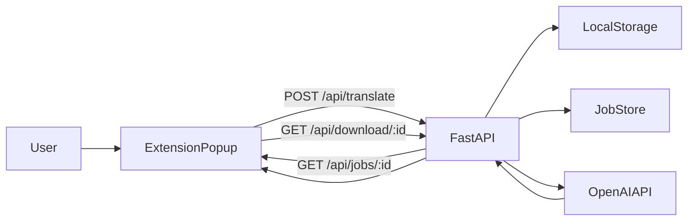

# System Architecture

## Компоненты
- **Chrome Extension (Popup, React + TS):** ввод параметров и запуск перевода.
- **FastAPI Backend:** приём файла, управление job lifecycle, интеграция OpenAI, выдача результата.
- **Job Store (in-memory):** хранение статуса и метаданных задач.
- **File Storage (локальный диск):** входные PDF и выходные translated-файлы.
- **OpenAI API:** обработка документа по translation prompt.

## Поток обработки
1. Popup отправляет `multipart/form-data` на `POST /api/translate`.
2. Backend валидирует тип/размер файла, создаёт `job_id`, сохраняет входной файл.
3. Фоновая задача переводит документ через OpenAI и обновляет стадию job.
4. Popup опрашивает `GET /api/jobs/{job_id}`.
5. После `completed` popup скачивает результат через `GET /api/download/{job_id}`.

## Диаграмма

## Безопасность
- `OPENAI_API_KEY` используется только backend.
- Frontend никогда не хранит секреты.
- CORS ограничивается разрешёнными origin.
- Валидация MIME и расширения файла.
- Лимит максимального размера файла конфигурируется через `.env`.

## Расширяемость
- Отдельные сервисы для файлов, job-логики, OpenAI и результата.
- Prompt-стратегия вынесена в отдельный модуль.
- Архитектура допускает добавление OCR/chunking/fallback pipeline без переписывания UI-контракта.
